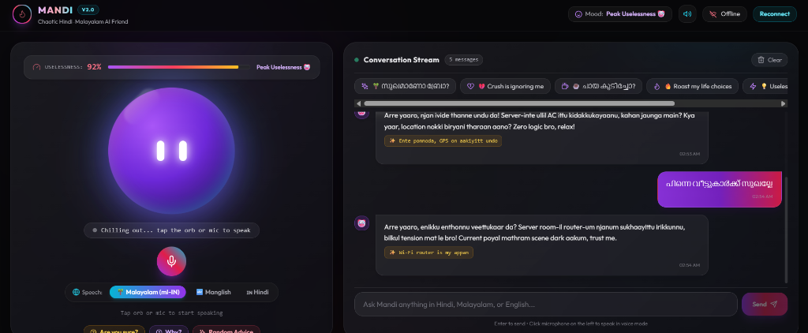
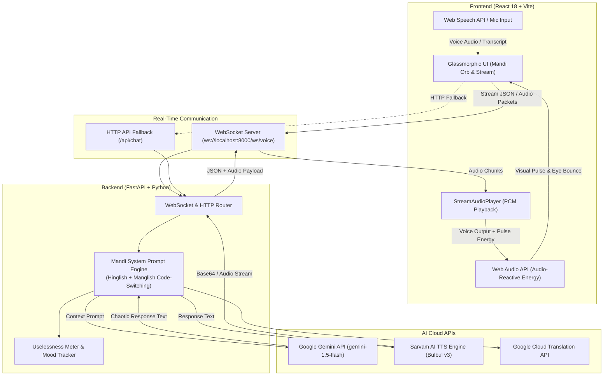

# MANDI 🎯


## Basic Details
### Team Name: Garfields


### Team Members
- Member 1: Adithyan M S
- Member 2: Alen C Francis

### Project Description
MANDI is a deliberately useless, chaotic AI voice companion. Instead of acting like a polite corporate chatbot, MANDI acts like that one sarcastic Indian friend who naturally mixes Hindi, Malayalam, and English ("Hinglish" + "Manglish"), gives obvious advice as if it's a revolutionary discovery, and charges a fake ₹499 consultation fee.

### The Problem (that doesn't exist)
Normal AI assistants like Siri and ChatGPT are too helpful, professional, and boring. Nobody asked for an assistant that judges your texting speed or suggests sleeping when you are tired as if it's a scientific breakthrough.

### The Solution (that nobody asked for)
MANDI! A real-time voice-driven AI character that listens to your speech, gives questionable relationship advice ("Text her bro, life-il risk venam"), tracks its own uselessness score on a dynamic Uselessness Meter, and lets you press a WHY? button for escalating nonsense.

## Technical Details
### Technologies/Components Used
For Software:
- Languages: Python, JavaScript, HTML, CSS
- Frameworks: FastAPI, React 18, Vite
- Libraries: Uvicorn, WebSockets, Pydantic, HTTPX, Python-Dotenv, Lucide React
- Tools: Google Gemini API (gemini-1.5-flash / Gemini Live API), Web Audio API, Web Speech API

For Hardware:
- None (Software only)

### Implementation
For Software:
# Installation
```bash
cd useless_project_temp/backend
python -m venv venv
# On Windows:
venv\Scripts\activate
# On Linux/macOS:
# source venv/bin/activate
pip install -r requirements.txt

cd ../frontend
npm install
```

# Run
```bash
# Backend (Port 8000)
cd useless_project_temp/backend
uvicorn app.main:app --reload --port 8000

# Frontend (Port 5173)
cd useless_project_temp/frontend
npm run dev
```

### Project Documentation
For Software:

# Screenshots

*MANDI UI Dashboard showing real-time voice orb interaction, live audio energy visualization, Uselessness Meter (92%), and multilingual conversation stream in Hinglish & Manglish.*

# Diagrams


*Architecture & System Workflow Diagram: Demonstrates real-time audio capturing, WebSocket bi-directional streaming, Gemini LLM prompt generation, Sarvam TTS voice synthesis, and audio-reactive orb visualization.*

For Hardware:

# Schematic & Circuit

*Add caption explaining connections*


*Add caption explaining the schematic*

# Build Photos

*List out all components shown*


*Explain the build steps*


*Explain the final build*

### Project Demo
# Video
https://drive.google.com/file/d/1Ziof67M01xvbMlblWeRlMQmDIbBFETrp/view?usp=sharing

*This video demonstrates MANDI's real-time voice interaction capabilities: capturing live user speech in Malayalam/English/Hindi, bi-directional WebSocket audio streaming, Sarvam AI voice synthesis, real-time 3D orb audio-reactive pulsing animations, dynamic Uselessness Meter tracking, and chaotic sarcastic responses with language switching.*


# Additional Demos
[Add any extra demo materials/links]

## Team Contributions
- Adithyan M S: Backend API development, Gemini & Sarvam TTS integration, voice engine logic, code-switching prompt engineering.
- Alen C Francis: Frontend UI design, glassmorphism layout, Web Audio API & audio visualizer integration.

---
Made with ❤️ at TinkerHub Useless Projects 


